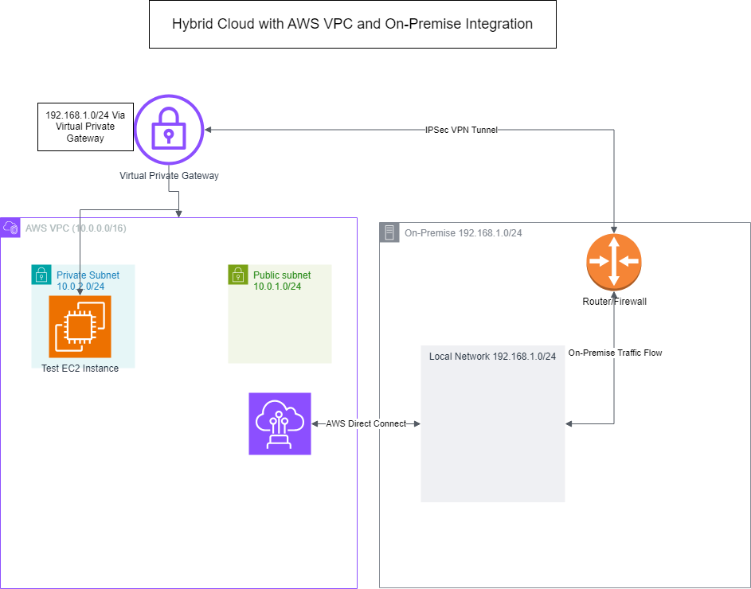

# Hybrid Cloud with AWS VPC and On-Premises VPN Integration

## Overview
This project demonstrates a **Hybrid Cloud Architecture** connecting an **AWS VPC** with an **on-premises network** through **Site-to-Site VPN** and **AWS Direct Connect**. The architecture is designed for secure, private connectivity between AWS resources and an on-premises environment, simulating a real-world hybrid cloud solution.

## Architecture Diagram

## Components
- **AWS VPC (Virtual Private Cloud)**: A dedicated network within AWS configured with both public and private subnets.
- **Private Subnet**: Contains resources like an EC2 instance that is accessible from the on-premises network.
- **Virtual Private Gateway**: Allows secure connectivity from the AWS VPC to on-premises resources via Site-to-Site VPN.
- **Direct Connect Gateway**: Provides a dedicated, private connection to the on-premises network.
- **On-Premises Network**: Represents the corporate network environment, connected to AWS through a router/firewall.

## Project Objectives
- Set up a **VPC** with private and public subnets in AWS.
- Configure a **Site-to-Site VPN** for secure connectivity to the on-premises network.
- Optionally, add an **AWS Direct Connect** link for high-speed, low-latency connectivity.
- Test connectivity by accessing an EC2 instance in the private subnet from the on-premises network.

## Prerequisites
- An **AWS Account** with permissions to create VPC, VPN, and Direct Connect resources.
- **VPN-capable router or firewall** on the on-premises side.
- Basic knowledge of networking concepts, including subnets, CIDR blocks, and routing.

## Step-by-Step Setup

### 1. Create the AWS VPC Environment
- Set up a VPC with a CIDR block of `10.0.0.0/16`.
- Create **Public and Private Subnets** within this VPC.
- Attach an **Internet Gateway** (if required for testing) and a **Virtual Private Gateway**.

### 2. Configure the Site-to-Site VPN
- Create a **Customer Gateway** representing the on-premises network.
- Set up a **Virtual Private Gateway** in AWS and attach it to the VPC.
- Establish a **VPN connection** and configure routing to allow traffic between AWS and on-premises.

### 3. Set Up AWS Direct Connect (Optional)
- Request a **Direct Connect connection** from AWS for a dedicated link.
- Create a **Direct Connect Gateway** and associate it with the VPC.

### 4. Test Connectivity
- Launch a **Test EC2 Instance** in the private subnet.
- Test connectivity from the on-premises network to the EC2 instance to verify the VPN and Direct Connect configurations.

## Resources
- [AWS VPC Documentation](https://docs.aws.amazon.com/vpc/latest/userguide/what-is-amazon-vpc.html)
- [AWS Site-to-Site VPN Documentation](https://docs.aws.amazon.com/vpn/latest/s2svpn/what-is-s2svpn.html)
- [AWS Direct Connect Documentation](https://docs.aws.amazon.com/directconnect/latest/UserGuide/Welcome.html)

## Diagram Explanation
The diagram above illustrates the hybrid cloud architecture:
- **Private and Public Subnets**: Located within the AWS VPC to separate internet-accessible resources from private resources.
- **Virtual Private Gateway**: Connects AWS resources securely to on-premises resources over a Site-to-Site VPN.
- **Direct Connect Gateway**: Provides an optional, dedicated connection to on-premises, bypassing the public internet.
- **Router/Firewall**: Represents the VPN endpoint on the on-premises side, allowing communication between AWS and on-premises.

## License
This project is open-source and available under the MIT License.
